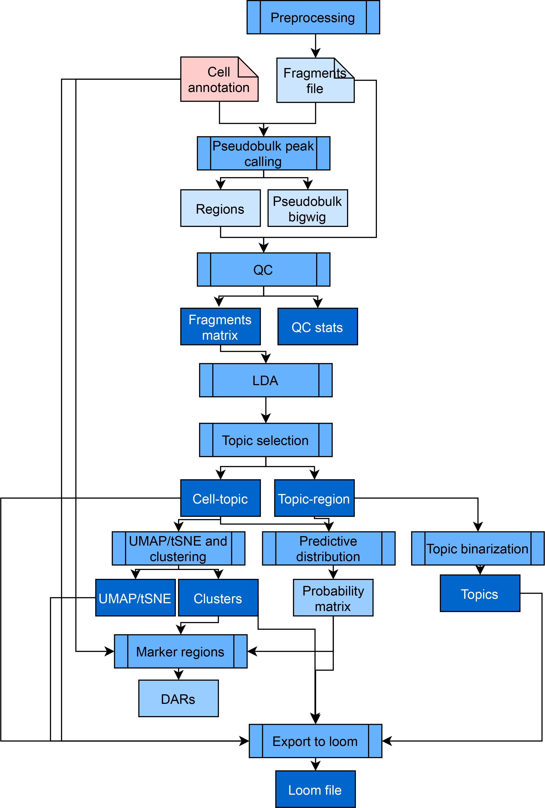

# Features

**pycisTopic** is an improved Python-based version of our Bayesian framework **cisTopic**, which exploits a topic modelling technique called **Latent Dirichlet Allocation (LDA)**. This unsupervised approach simultaneously clusters cells and co-accessible regions into regulatory topics, and it is among the top performers across numerous independent single-cell epigenomics benchmarks.

Outside of the SCENIC+ framework, pycisTopic can also be used to analyze independent scATAC-seq data. The full pycisTopic pipeline consists of the following steps:

- **(RQ)**: Required for the SCENIC+ workflow  
- **(RC)**: Recommended for the SCENIC+ workflow  

---

## Consensus Peak Calling (RQ)

pycisTopic first creates a set of consensus peaks across all cells by calling and merging peaks on pseudobulk ATAC-seq profiles per cell type.

1. **Pseudobulk generation**
   - Using the fragments file and barcode–cell type annotations, pseudobulk fragment BED files and coverage bigWig files are generated per cell type.

2. **Peak calling**
   - Peaks are called in each pseudobulk using **MACS2** with the following parameters:
     - `--format BEDPE`
     - `--keep-dup all`
     - `--shift 73`
     - `--ext_size 146`

3. **Consensus peak derivation**
   - Peaks are merged using the iterative overlap peak-merging procedure described in *Corces et al. (2018)*.
   - Each summit is extended by `peak_half_width` (default: 250 bp) in both directions.
   - Overlapping peaks are filtered iteratively, retaining the most significant peak.

### Peak-merging rules

- **1 peak**: The original peak is kept.
- **2 peaks**: The peak with the highest score is kept.
- **3 or more peaks**:
  - The most significant region is kept.
  - Overlapping, less significant peaks are removed.

This procedure is applied twice:
1. Independently per pseudobulk.
2. Globally after peak score normalization.

Using pseudobulk peaks improves signal quality, especially for rare cell types, compared to using bulk peaks across the entire population.

For independent scATAC-seq data, cell annotations can be obtained via alternative methods such as preliminary clustering using predefined genome-wide regions (e.g. SCREEN).

---

## QC Analysis and Cell Selection (RC)

pycisTopic computes quality control (QC) metrics at both the **sample level** and the **barcode level**.

### Sample-level QC metrics

- **Barcode Rank Plot**
    Shows the distribution of non-duplicate reads per barcode. A clear “knee” indicates good separation between cell-associated barcodes and empty partitions.

- **Insertion Size**
    A high-quality ATAC-seq library shows:
    - A sharp peak at <100 bp (open chromatin)
    - A peak at ~200 bp (mono-nucleosome)
    - Additional peaks for multi-nucleosomes

- **Sample TSS Enrichment**
    Reads are aggregated ±1000 bp around transcription start sites (TSSs). The signal is normalized to flanking regions. Strong enrichment at the TSS indicates good signal-to-noise ratio.

- **FRiP Distribution**
    **Fraction of Reads in Peaks (FRiP)** measures usable reads in enriched peaks relative to all usable reads. Low FRiP indicates noisy data.

- **Duplication Rate**
    Estimates the fraction of PCR duplicates. High duplication rates may indicate over-sequencing or poor library complexity.

---

### Barcode-level QC metrics

Used to select high-quality cells:

- **Total number of unique fragments**
- **TSS enrichment**
  - Normalized coverage at the TSS position (±10 bp)
- **FRiP**
  - Fraction of reads in peaks per barcode  
  - Should be interpreted carefully for rare populations, where peaks may be undercalled

---

## Count Matrix Generation (RQ)

pycisTopic generates a fragment count matrix from:
- Fragment files
- A set of regions (preferably consensus peaks)
- A list of high-quality cells

Alternatively, a precomputed count matrix can be used. This step creates a **cisTopic object** containing:
- Fragment counts
- Fragment file paths
- Cell and region metadata

---

## Doublet Identification

The fragment count matrix can be used as input for **Scrublet (v0.2.3)**.  
For 10x datasets, the default expected doublet rate is **10%**.

---

## Topic Modelling and Model Selection (RQ)

pycisTopic implements two topic modelling algorithms:

- **Serial LDA** with a Collapsed Gibbs Sampler
- **MALLET**, enabling parallelized LDA estimation

Default parameters match those used in cisTopic. Additional model selection metrics include:

- **Minmo_2011**  
  Average topic coherence (higher is better)
- **Log-likelihood**  
  Final iteration log-likelihood (higher is better)
- **Arun_2010**  
  Density-based metric (lower is better)
- **Cao_Juan_2009**  
  Divergence-based metric (lower is better)

---

## Dimensionality Reduction and Batch Effect Correction (RC)

- Clustering using **Leiden**
- Dimensionality reduction using **UMAP** and **t-SNE**
- Batch correction using **harmonypy**
- Multiome data can be jointly embedded using scRNA-seq and scATAC-seq data

---

## Topic Binarization and QC (RQ)

Topics are converted into region sets for downstream analyses. Supported binarization methods:

- `otsu`
- `yen`
- `li`
- `aucell`
- `ntop`

Default behavior:
- **Otsu** for topic–region distributions
- **AUCell** for cell–topic distributions

### Topic QC metrics

- Number of assignments and regions/cells per topic
- **Topic coherence** (Mimno et al., 2011)
- **Marginal topic distribution**
- **Gini index** (specificity from 0 to 1)

---

## Drop-out Imputation (RQ)

Drop-outs are imputed by multiplying the cell–topic and topic–region distributions, yielding probabilistic accessibility estimates per region per cell.

---

## Differentially Accessible Regions (DARs) (RQ)

DARs are identified using a Wilcoxon rank-sum test:
- Default thresholds:  
  - `padj < 0.05`  
  - `logFC > 0.5`

Custom contrasts can also be specified.

---

## Gene Activity and Differentially Accessible Genes (DAGs)

Gene activity summarizes accessibility around genes. DAGs can be derived from this matrix.

### Configuration options

- **Search space**
  - Gene boundaries, upstream/downstream distances
  - Optional promoter exclusion
- **Distance weight**
  - Exponential decay based on distance
- **Gene size weight**
  - Corrects for bias toward large genes
- **Gini weight**
  - Prioritizes specifically accessible regions

---

## Label Transfer

Label transfer from scRNA-seq data using gene activity matrices via:
- `ingest`
- `harmony`
- `bbknn`
- `scanorama`
- `cca`

All except `ingest` return a shared co-embedding.

---

## pyGREAT

pycisTopic automates **GREAT** analysis by submitting region sets to the GREAT web server and retrieving results programmatically.

---

## Signature Enrichment

Epigenomic signatures are intersected with regulatory regions and evaluated using **AUCell**.  
Default AUC threshold: **top 5% of regions**.

---

## Export to Loom Files (RC)

cisTopic objects can be exported to **loom** files compatible with:
- **SCope**
- **SCopeLoomR**

---

*SCENIC+ minimal pycisTopic workflow (starting from multiome data).*
