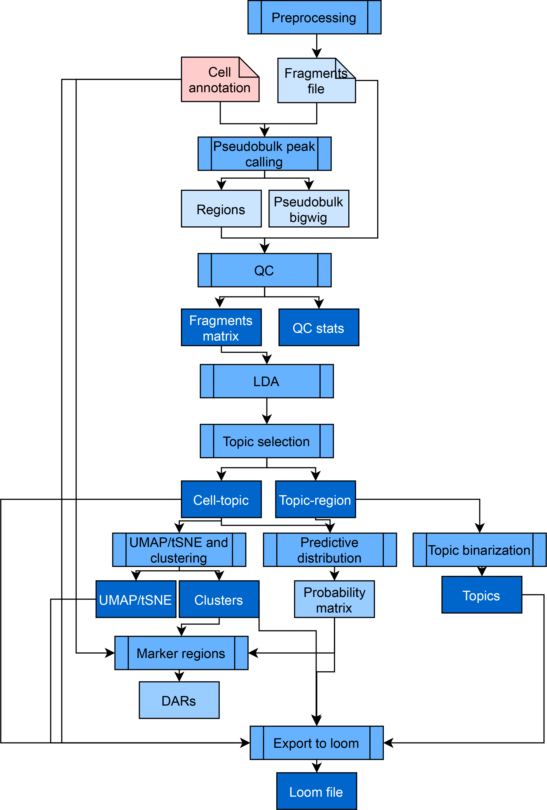

**************
Features
**************

Pycistopic is an improved Python-based version of our Bayesian framework cisTopic, which exploits a topic modelling technique called Latent Dirichlet Allocation (LDA). This unsupervised approach simultaneously clusters cells and co-accessible regions into regulatory topics, and it is among the top performers among numerous independent single-cell epigenomics benchmarks. Outside of the SCENIC+ framework, pycisTopic can be used to analyze independent scATAC-seq data as well. PycisTopic is available at https://github.com/aertslab/pycisTopic , with full documentation and tutorials available at pycistopic.readthedocs.io The full pycisTopic pipeline consists of the following steps ((RQ) indicates those required for the SCENIC+ workflow, (RC) indicates those recommended for the SCENIC+ workflow):

	* **Consensus peak calling (RQ)**: PycisTopic will first create a set of consensus peaks across all cells by calling and merging peaks on pseudobulk ATAC-seq profiles per cell type. First, utilising the fragments file and barcode-cell type annotations provided by the user we generate pseudobulk fragments bed files and coverage bigwig files per cell type. In a second step, peaks are called in each of these pseudobulks using MACS2, using `–format BEDPE` (as we are providing fragments bed files as input) and `–keep-dup all --shift 73  --ext_size 146`, as recommended for scATAC-seq data. To derive a set of consensus peaks, we use the iterative overlap peak merging procedure describe in Corces et al. (2018).  First, each summit is extended a `peak_half_width` (by default, 250bp) in each direction and then we iteratively filter out less significant peaks that overlap with a more significant one. During this procedure peaks will be merged and depending on the number of peaks included into them, different processes will happen: 
		
		#. 1 peak: The original peak will be kept
		#. 2 peaks: The original peak region with the highest score will be kept
		#. 3 or more peaks: The original region with the most significant score will be taken, and all the original peak regions in this merged peak region that overlap with the significant peak region will be removed. 
		
		The process is repeated with the next most significant peak (if it was not removed already) until all peaks are processed. This procedure will happen twice, first in each pseudobulk peaks, and after peak score normalization to process all peaks together. We recommend using this set of regions downstream, as we (and others) have observed that using pseudobulk peaks improves signal compared to using bulk peaks across the whole population (specially for rare cell types, whose signal may be confused by noise while using the merged ATAC-seq profile of the whole population).  In case of independent scATAC-seq data, the cell annotation can also be obtained from alternative methods, such as a preliminary clustering analysis using a predefined set of genome-wide regions/peaks (e.g. SCREEN) as input to identify cell populations.

	* **QC analysis and cell selection (RC)**: PycisTopic computes QC metrics at the sample-level and the barcode-level. Sample-level statistics can be used to assess the overall quality of the sample, while barcode level statistics can be used to differentiate good quality cells versus the rest. These metrics include: 
		
		* **Barcode rank plot:** The barcode rank plot shows the distribution of non-duplicate reads and which barcodes were inferred to be associated with cells. A steep drop-off ('knee') is indicative of good separation between the cell-associated barcodes and the barcodes associated with empty partitions.
		* **Insertion size**: ATAC-seq requires a proper pair of Tn5 transposase cutting events at the ends of DNA. In the nucleosome-free open chromatin regions, many molecules of Tn5 can kick in and chop the DNA into small pieces; around nucleosome-occupied regions, and Tn5 can only access the linker regions. Therefore, in a good ATAC-seq library, you should expect to see a sharp peak at the <100 bp region (open chromatin), and a peak at ~200bp region (mono-nucleosome), and other larger peaks (multi-nucleosomes). A clear nucleosome pattern indicates a good quality of the experiment.
		* **Sample TSS enrichment**: The TSS enrichment calculation is a signal to noise calculation. The reads around a reference set of TSSs are collected to form an aggregate distribution of reads centered on the TSSs and extending to 1000 bp in either direction (for a total of 2000bp). This distribution is then normalized by taking the average read depth in the 100bp at each of the end flanks of the distribution (for a total of 200bp of averaged data) and calculating a fold change at each position over that average read depth. This means that the flanks should start at 1, and if there is high read signal at transcription start sites (highly open regions of the genome) there should be an increase in signal up to a peak in the middle.
		* **FRiP distribution**: Fraction of all mapped reads that fall into the called peak regions, i.e. usable reads in significantly enriched peaks divided by all usable reads. A low FRIP indicates that many reads form part of the background, and so that the data is noisy.
		* **Duplication rate**: A fragment is considered “usable” if it uniquely maps to the genome and remains after removing PCR duplicates (defined as two fragments that map to the same genomic position and have the same unique molecular identifier). The duplication rate serves to estimate the amount of usable reads per barcode. High duplication rates may indicate over-sequencing or lack of fragments after transposition and encapsulation.
		
		On the other hand, barcode-level statistics can be used to select high-quality cells.  Typical measurements that can be used are:
		
		* **Total number of (unique) fragments**
		* **TSS enrichment**: The normalized coverage at the TSS position for each barcode (average +-10bp from the TSS). Noisy cells will have a low TSS enrichment.
		* **FRiP**: The fraction of reads in peaks for each barcode. Noisy cells have low FRIP values. However, this filter should be used with nuance, as it depends on the quality of the original peaks. For example, if there is a rare population in the sample, its specific peaks may be missed by peak calling algorithms, causing a decrease in their FRIP values.

	* **Count matrix generation (RQ)**: PycisTopic can generate a fragment count matrix from the fragments files, a set of regions (preferably, consensus regions as previously explained) and a list of high quality cells. Alternatively, a precomputed count matrix can also be used as input. In this step a cisTopic object will be created, including the fragment counts, path/s to the fragments files (if used to generate the count matrix) and cell/region metadata.

	* **Doublet identification**: The fragment count matrix can be used as input for Scrublet102 (v0.2.3), By default, and when dealing with 10x data sets, we set the expected doublet rate to 10%.

	* **Topic modelling algorithms and model selection (RQ)**: PycisTopic implements two algorithms for topic modelling, serial LDA with a Collapsed Gibbs Sampler (as implemented in the lda module) and Mallet, which allows to parallelize the LDA model estimation. We use the same default parameters as in cisTopic. In addition, we have included additional metrics for model selection:
		
		* **Minmo_2011**: Uses the average model coherence as calculated by Mimno et al (2011). To reduce the impact of the number of topics, we calculate the average coherence based on the top selected average values. The better the model, the higher coherence.
		* **Log-likelihood**: Uses the log-likelihood in the last iteration as calculated by Griffiths and Steyvers (2004), as used in cisTopic. The better the model, the higher the log-likelihood.
		* **Arun_2010**: Uses a density-based metric as in Arun et al (2010) using the topic-region distribution, the cell-topic distribution and the cell coverage. The better the model, the lower the metric.
		* **Cao_Juan_2009**: Uses a divergence-based metric as in Cao Juan et al (2009) using the topic-region distribution. The better the model, the lower the metric.

	* **Dimensionality reduction and batch effect correction (RC)**: We can cluster the cells (or regions) using the leiden algorithm and perform dimensionality reduction with UMAP and TSNE using the cell-topic (or topic region distributions). In addition, harmonypy (v0.0.5) can be used on scaled cell-topic distributions to correct for batch effect between samples (see mouse cortex analysis). When working with single-cell multiome data, it is possible to co-cluster and reduce dimensionality using both the scRNA-seq and scATAC-seq data by using UMAP to build fuzzy simplicial sets (similar to KNN graphs).

	* **Topic binarization and QC (RQ)**: To perform motif analysis (and other downstream steps) we need to have topics as region sets rather than continuous distributions. We have included several binarization methods (applicable for topic-region and cell-topic distributions): 'otsu' (Otsu, 1979), 'yen' (Yen et al., 1995), 'li' (Li & Lee, 1993), 'aucell' (Van de Sande et al., 2020) or 'ntop' (Taking the top n regions per topic). Otsu and Yen's methods work well in topic-region distributions; however, for some downstream analyses it may be convenient to use 'ntop' to have balanced region sets. By default, pycisTopic uses Otsu for binarization. For cell-topic distributions, we recommend using the AUCell method. In addition, pycisTopic includes new metrics to assess topic quality:
		
		* **Number of assignments and regions/cells per binarized topic.**
		* **Topic coherence (Mimno et al., 2011)**: Measures to which extent high scoring regions in the topic are co-accessible in the original data. If it is low, it indicates that the topic is rather random. The higher, the better is a topic.
		* **The marginal topic distribution**: Indicates how much each topic contributes to the model. The higher, the better is a topic.
		* **The gini index**: Value between 0 and 1, that indicates the specificity of topics (0: General, 1: Specific)

	* **Drop-out imputation (RQ)**: Thanks to the probabilistic nature of topic modelling, drop-outs can be imputed by multiplying the cell-topic and topic-region distributions, resulting in a matrix with the probabilities of each region in each cell. This approach was already available in cisTopic and has been extensively validated in external works.

	* **Calculation of Differentially Accessible Regions (DARs) (RQ)**: Using the imputed fragment matrix we can identify Differentially Accessible Regions, or DARs, between cell types. Briefly, we perform a Wilcoxon rank-sum test between each group in the specified variable and the rest. Alternatively, specified contrast can be provided as a list with foreground and background groups. By default, we identify a region as a DAR if padj < 0.05 and LogFC > 0.5.

	* **Gene activity and Differentially Accessible Genes (DAGs)**: The gene activity recapitulates the overall accessibility values in a space around the gene. Differentially Accessible Genes (DAGs) can be derived from this matrix. The user can select among different options:
		
		* **Search space**: The user can choose whether the search space should include other genes or not (use_gene_boundaries), and the minimum and maximum distance it should have (upstream and downstream). Promoters can be excluded from the calculations, as they are usually ubiquitously accessible.
		* **Distance weight**: The parameters related to the distance weight measure the impact of distance when inferring region to gene weights as an exponential function. The user can control whether this weight should be used (distance_weight) and the effect of the distance (decay_rate). In addition, the user can choose from which distance to the gene body this weight is applied (extend_gene_body_upstream and extend_gene_body_downsstream)
		* **Gene size weight**: Large genes may have more peaks by chance. The user can optionally apply a weight based on the size of each gene (gene_size_weight), which by default is dividing the size of each gene by the median gene size in the genome. Alternatively, the user can also use average_scores which will calculate the gene activity as the mean weighted region accessibility of all regions linked to the gene.
		* **Gini weight**: This weight will give more importance to specifically accessible regions (gini_weight).

	* **Label transfer**: PycisTopic includes wrappers for several label transfer methods using annotated scRNA-seq and the gene activity matrix. The methods available for label transferring are: ‘ingest’, 'harmony', 'bbknn', 'scanorama' and 'cca'. Except for ingest, these methods return a common coembedding and labels are inferred using the distances between query and reference cells as weights.

	* **pyGREAT**: pycisTopic makes GREAT (Genomic Regions Enrichment of Annotations Tool) analysis automatic by constructing a HTTP POST request according to and input region set and automatically retrieving results from the GREAT web server, analogously to the rGREAT package in R.

	* **Signature enrichment**: Given epigenomic signatures are intersected with the regulatory regions in the dataset and summarized into region sets. Using the imputed fragment matrix, all regions in each cell are ranked and the cell-specific rankings are used as input for AUCell. By default, we use 5% of the total number of regions in the dataset as a threshold to calculate the AUC.

	* **Export to loom files (RC)**: PycisTopic allows to export cisTopic object to loom files compatible with Scope for visualization and SCopeLoomR, for importing pycisTopic analyses into R.

SCENIC+ minimal pycisTopic workflow (starting from multiome data).
